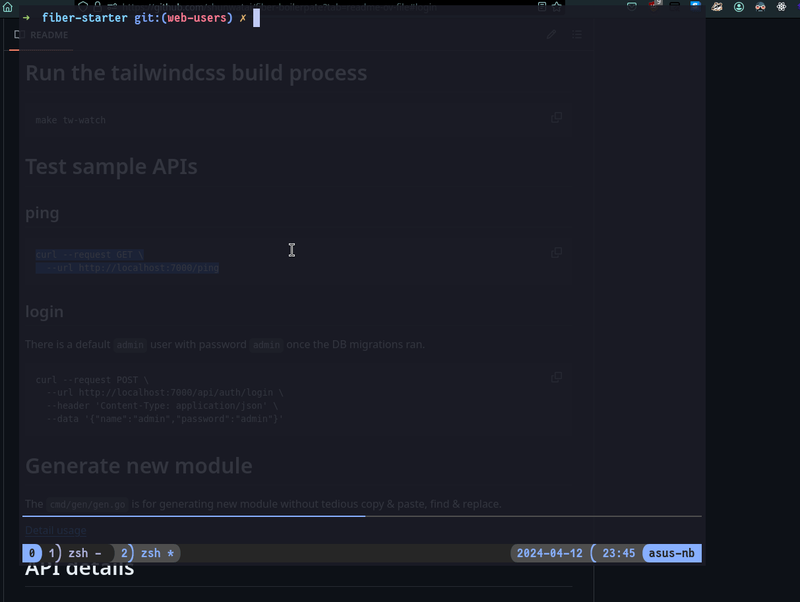

# Fiber boilerpate
This is my personal repo just for fun which for myself startng a golang REST API quicker and learn about golang.

It runs by fiber with basic CRUD routes which follows the Controller-Service-Repository pattern like Spring boot or Laravel's structure.

# Features
- With implementations of `postgres`, `sqlite`, `mariadb`, `mongodb` for accessing records in DB in `internal/database/`. Just raw sql without ORM.
- Swtich to different DB driver by config.
- With example of pre-defined modules like `users`, `todos`, `documents` etc. in `interal/modules/`, with CRUD APIs.
- `HTMX` web templates with `tailwind` & `alpinejs`.
- With a [script](#generate-new-module) `cmd/gen/gen.go` for generate new module in `internal/modules/`.
- JWT auth, [login sample by curl](#login).
- Can generate swagger doc by `swag`.
- Make use of `viper` for loading env variables in config.
- With a logging wrapper by `zap` which uses as middleware for writing the request's logs in `log/`, the log file maybe used for centralised log server like ELK or Signoz. 

# Todo
- [ ] Need more test cases & validations
- [ ] Add GET `/me`
- [ ] Try `bubbletea` for `cmd/gen/gen.go`
- [ ] Web template example by htmx
    - [x] Login page
    - [x] Forget page
    - [x] Users page CRUD
        - [x] Users list
        - [x] User form
    - [ ] Todos page
        - [x] Todos list
        - [ ] Todo form with upload file
- [ ] Try Oauth

# Project structure
I try following the standards from [project-layout](https://github.com/golang-standards/project-layout) as much as I can.

```
├── assets
├── bin
├── build
├── cmd
│   ├── dbmigrate                   # for run the db migrations in migrations/
│   ├── gen                         # for generate the new modules in internal/modules & migrations/
│   └── server                      # go fiber things
├── compose-db.yaml                 # db containers for dev
├── compose-dev.yaml
├── compose-prod.yaml
├── configs                         # config files for storing the ENV variables read by viper
│   ├── docker.yaml
│   └── localhost.yaml
├── db-backup
├── db.env                          # read by compose-db.yaml when initiating dev DBs
├── Dockerfile                      # read by compose-dev.yaml
├── Dockerfile.prod                 # read by compose-prod.yaml
├── docs                            # swagger docs generated by "swag init"
├── fiber-starter.db
├── go.mod
├── go.sum
├── internal                        
│   ├── auth
│   ├── config                      # viper funcs for reading the config in configs/
│   ├── database                    # the databases implementations
│   ├── helper
│   ├── middleware
│   ├── modules                     # all APIs store here, they follow the "route-controller-service-repository" pattern
│   └── notification                # email notification functions here
├── log                             # storing the API log files
│   └── requests.log
├── main.go                         # the fiber starting point
├── Makefile
├── migrations                      # storing the DB migration files
├── node_modules                    # because of tailwind
├── package.json
├── package-lock.json
├── qrcodes                         # my stuffs
├── README.Docker.md
├── README.md
├── tailwind.config.js
├── uploads                         # storing the files uploaded by APIs. maybe put these files in assets/ later.
│   ├── xxx.pdf
│   └── yyy.jpg
└── web                             # serving the HTMX templates and web's libs
    ├── static
    └── template
```

# Quick start by docker-compose
1. [Start the databases containers](#start-databases-for-development)
2. [Run migrations with the desired database(pg/mariab/sqlite/mongodb)](migrations/README.md#run-migration)
3. [Set the db driver in configs/docker.yaml](#for-run-by-docker)
3. [Start fiber api by docker](#start-by-docker)
4. [Test the login api by curl for getting the JWT](#login)
5. [Try the user's web](internal/modules/user/README.md#web-crud)

# Install dependencies
If run the Fiber server without docker, install the following go packages.
## Air - hot reload
`air` for fiber hotreload.
```
go install github.com/cosmtrek/air@latest
```

## Go-migrate - db migration
`migrate` for run the database's migration.
```
go install -tags 'postgres mysql sqlite3 mongodb' github.com/golang-migrate/migrate/v4/cmd/migrate@latest
```

## Swag - swagger doc
`swag` command for generate swagger doc.
```
go install github.com/swaggo/swag/cmd/swag@latest
```

## Nodejs - tailwindcss CLI build
`npx` for running the tailwindcss command for frontend html template dev

# Config
## Edit config
### For run without docker
```
cp configs/localhost.yaml.sample configs/localhost.yaml
```

### For run by docker
```
cp configs/docker.yaml.sample configs/docker.yaml
```

## Set the db driver
At `database` section, edit the `engine`
```
...
database:
  engine: "postgres/sqlite/mariadb/mongodb"
...
```

# Start databases for development
1. copy and then edit the `db.env` if needed
```
cp db.env.sample db.env
```

2. Start all by docker-compose
Postgres, Mariadb & Mongodb will be started
```
docker-compose -f compose-db.yaml up -d
```

# Start the fiber api server
## For development
Set the `env` to `local` in the `configs/<localhost/docker>.yaml`

### Start without docker
```
air
```

### Start by docker
Run the dev container
```
make docker-dev
```
or
```
docker-compose -f compose-dev.yaml build fiber-api-dev --build-arg UID=$(id -u) && \
docker-compose -f compose-dev.yaml up -d
```

Check status
```
docker-compose -f compose-dev.yaml ps
```

Watch the log
```
make docker-dev-log
```

## For production
### Change config
Change the values in the `configs/<localhost/docker>.yaml`
- Change the `server.env` to `prod`
- Change the `server.host` 
- Change `jwt.secret` 
- Change `log.level` higher than `0`

### Start by docker
Run the production container
```
make docker-prod
```

Check status
```
docker-compose -f compose-prod.yaml ps
```

Watch the log
```
make docker-prod-log
```

# DB Migration
Install [go-migrate](https://github.com/golang-migrate/migrate) and the follow the [detail usage](migrations/README.md) for different DBs.

# Run the tailwindcss build process
```
make tw-watch
```

# Test sample APIs
## ping
```
curl --request GET \
  --url http://localhost:7000/ping
```


## login

There is a default `admin` user with password `admin` once the DB migrations ran.

```
curl --request POST \
  --url http://localhost:7000/api/auth/login \
  --header 'Content-Type: application/json' \
  --data '{"name":"admin","password":"admin"}'
```


# Generate new module
The `cmd/gen/gen.go` is for generating new module without tedious copy & paste, find & replace.

[Detail usage](cmd/gen/README.md)

# API details
## Users
[readme](internal/modules/user/README.md)

## Password reset
[readme](internal/modules/passwordReset/README.md)

# Run tests
To disable cache when running tests, run with options: `-count=1`
ref: https://stackoverflow.com/a/49999321

## Run all tests
```
go test -v -race ./... -count=1
```

## Run specific database tests

### Run sqlite's tests
```
go test -v ./internal/database -run TestSqliteConstructSelectStmtFromQuerystring -count=1
```

### Run mariadb's tests
```
go test -v ./internal/database -run TestMariadbConstructSelectStmtFromQuerystring -count=1
```

### Run postgres's tests
```
go test -v ./internal/database -run TestPgConstructSelectStmtFromQuerystring -count=1
```

### Run mongodb's tests
```
go test -v ./internal/database -run TestMongodbConstructSelectStmtFromQuerystring -count=1
```

# Swagger
## Edit the doc
In each module under `internal/modules/<module>/route.go`, edit the swagger doc before generate the `docs/` directory at next section below.

## Format swagger's comments & generate the swagger docs
```
$ swag fmt
$ swag init
```

## go to the swagger page by web browser
http://localhost:7000/swagger/index.html

# Send log to Signoz
## Spin up the otel container
```
docker run -d --name signoz-host-otel-collector --user root -v $(pwd)/log/requests.log:/tmp/requests.log:ro -v $(pwd)/otel-collector-config.yaml:/etc/otel/config.yaml --add-host host.docker.internal:host-gateway signoz/signoz-otel-collector:0.88.11
```
