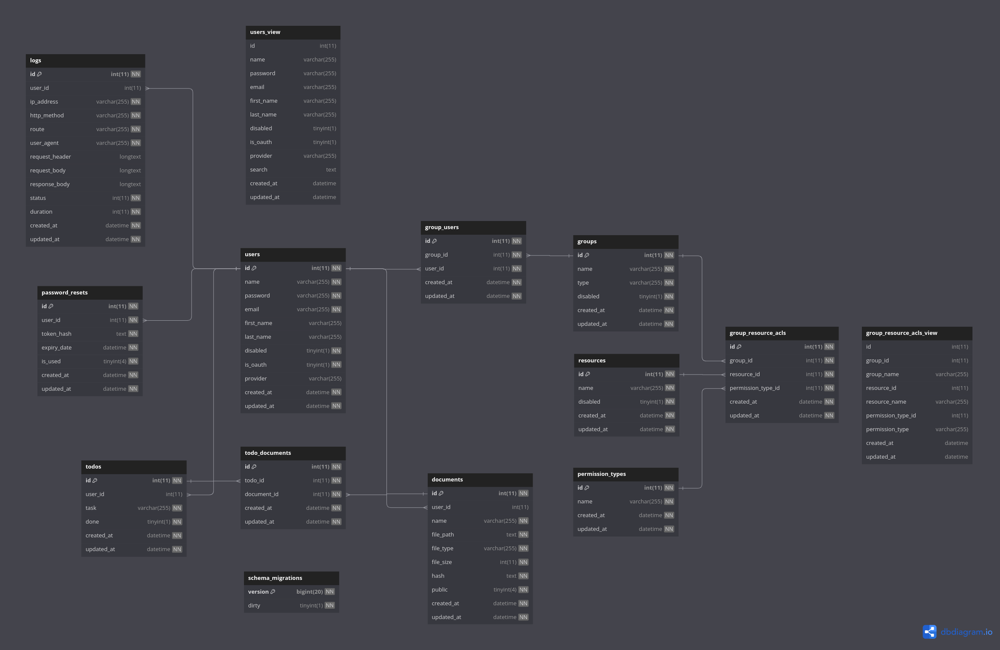

# modules

All APIs modules are here seperated by their folder name, and following the controller-service-repository architecture. 

Each of them should contain the following files:

- `type.go`: All the structs should put in this file. Other backend frameworks may call it as `model`, `entity` etc.

- `route.go`: All APIs endpoints should put in this file.

- `contorller.go`: Should do the validations of the requests payload before passing to `service` layer.

- `service.go`: All (business) logic should do in this layer.

- `repository.go`: If the module has database's table, all DB operations should be in this file. Else if some modules don't need to store data, this file can be omitted.

# ERD
A db diagram for showing the relations among the modules

# Descriptions of each folder
## user
TBC
## passwordReset
TBC
## group
TBC
## groupUser
TBC
## permissionType
TBC
## resource
TBC
## groupResourceAcl
TBC
## todo
TBC
## document
TBC
## todoDocument
TBC
## log
TBC
## qrcode
TBC
## oauth
TBC
## sample
TBC
## web
TBC
