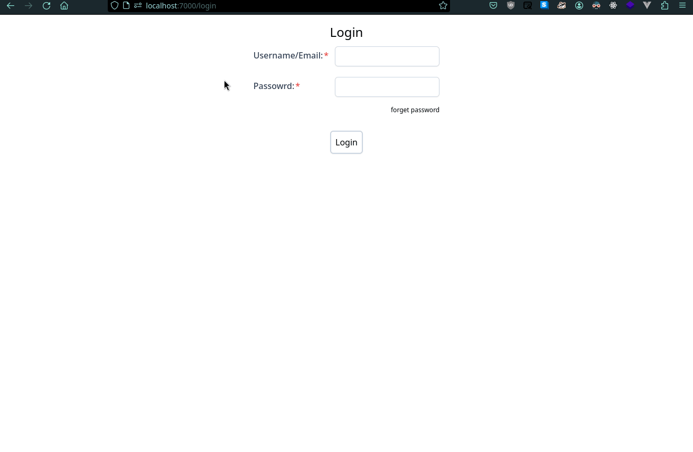

# Users

## API
url: `http://localhost:7000/swagger/index.html#/users`

## Web
### Login

url: `http://localhost:7000/login`

default admin login: admin/admin

### CRUD

url: `http://localhost:7000/users`

